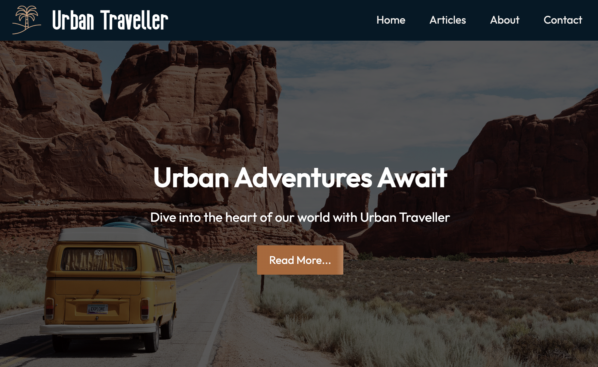

## Urban Traveller

## Project Exam 1



[See live site](https://urbantraveller.netlify.app/)

## Description

For my first-year examination at Noroff, I was assigned the task of designing a blog centered around a theme of my preference, with specific criteria to meet.

Key requirements included:

- Showcasing the most recent posts.
- Utilizing WordPress as a headless CMS.
- Enabling post filtering by category.

## Assignment Brief
You have been tasked with creating a blog site. You can choose the design and topics covered on the blog, but it should have at least the following pages:

* Home page
* About page
* List of blog posts
* Blog post specific pages
* Contact page

## Built With

- HTML
- CSS
- JavaScript
- Wordpress CMS

## Getting Started

### Installing

1. Clone the repo:

```bash
git clone https://github.com/Noroff-FEU-Assignments/project-exam-1-EVeskje.git
```

## Contributing

If you have any feedback or suggestions to make the project better, please fork the repo and create a pull request!

## Contact

Reach me at [linkedIn](https://www.linkedin.com/in/env-link/) or send an email to eirik.nv@hotmail.com
